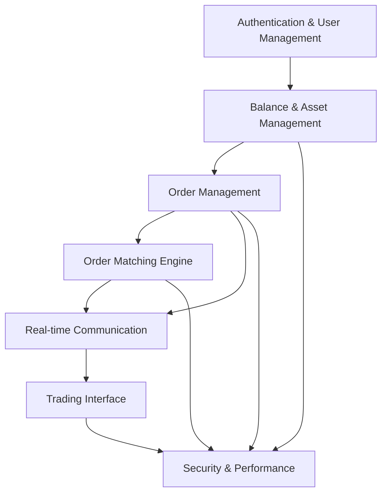

# Virgosoft Limit Order Exchange - Feature-Based Implementation Plan

## Overview
This document outlines a feature-based approach to implementing the Virgosoft Limit Order Exchange, with authentication covered first, followed by other features in logical dependency order. This approach ensures that each feature builds upon previously implemented functionality.

## Feature Implementation Order

### Feature 1: Authentication & User Management
**Goal**: Establish secure user authentication and basic profile management

#### 1.1 User Authentication Backend
- Set up Laravel Sanctum for API authentication
- Create user registration and login API endpoints
- Implement password reset functionality
- Add proper input validation and security measures
- Create user profile endpoint with balance information

#### 1.2 Authentication Frontend
- Create Login.vue component
- Create Register.vue component
- Implement useAuth.js composable for authentication state
- Add authentication guards for protected routes
- Create profile management interface

#### 1.3 User Management Testing
- Write unit tests for authentication logic
- Write feature tests for API endpoints
- Test authentication security measures
- Test session management and token handling

### Feature 2: Balance & Asset Management
**Goal**: Implement secure balance and cryptocurrency asset management

#### 2.1 Balance & Asset Backend
- Create migration for assets table (user_id, symbol, amount, locked_amount)
- Add balance column to users table
- Create Asset model with proper relationships
- Implement AssetRepository and AssetService
- Add balance update operations with atomic transactions
- Implement asset locking for sell orders

#### 2.2 Balance & Asset Frontend
- Create BalanceDisplay.vue component
- Implement useBalance.js composable
- Add asset management interface
- Create balance update notifications
- Implement transaction history display

#### 2.3 Balance & Asset Testing
- Write unit tests for asset operations
- Test atomic balance updates
- Test asset locking mechanisms
- Write concurrent balance update tests

### Feature 3: Order Management
**Goal**: Implement limit order creation, cancellation, and management

#### 3.1 Order Management Backend
- Create migration for orders table (user_id, symbol, side, price, amount, status)
- Create Order model with relationships and scopes
- Implement OrderRepository and OrderService
- Add order validation and creation logic
- Implement order cancellation with fund release
- Add proper error handling and status management

#### 3.2 Order Management Frontend
- Create OrderForm.vue component for placing orders
- Create OrderHistory.vue component for user orders
- Implement useOrders.js composable for order management
- Add order status indicators and updates
- Implement order cancellation interface

#### 3.3 Order Management Testing
- Write unit tests for order operations
- Test order validation logic
- Test order cancellation and fund release
- Write concurrent order creation tests

### Feature 4: Order Matching Engine
**Goal**: Implement the core order matching logic with race condition safety

#### 4.1 Matching Engine Backend
- Create migration for trades table (buy_order_id, sell_order_id, symbol, price, amount, commission)
- Create Trade model with relationships
- Implement OrderMatchingService with atomic operations
- Create OrderMatchingJob for queue-based processing
- Implement commission calculation logic (1.5% of matched USD value)
- Add proper locking mechanisms to prevent race conditions

#### 4.2 Matching Engine Frontend
- Create OrderBook.vue component for market orders
- Implement real-time order book updates
- Add trade execution notifications
- Create trade history display
- Implement order status updates in real-time

#### 4.3 Matching Engine Testing
- Write unit tests for matching logic
- Test commission calculations
- Write concurrent order matching tests
- Test race condition prevention mechanisms

### Feature 5: Real-time Communication
**Goal**: Implement real-time updates for order matching and balance changes

#### 5.1 Real-time Backend
- Configure Laravel Broadcasting with Pusher
- Create events for OrderMatched, OrderCreated, OrderCancelled, BalanceUpdated
- Set up private channels for user-specific updates
- Configure proper authentication for channels
- Add comprehensive error handling for broadcasting

#### 5.2 Real-time Frontend
- Create useWebSocket.js composable for real-time connections
- Implement real-time order book updates
- Add balance and asset update notifications
- Handle connection errors and reconnection logic
- Create TradeNotifications.vue component

#### 5.3 Real-time Testing
- Write tests for broadcasting events
- Test WebSocket connection handling
- Test real-time update delivery
- Test connection error recovery

### Feature 6: Trading Interface
**Goal**: Build a comprehensive trading dashboard

#### 6.1 Trading Dashboard Backend
- Implement order book API endpoint
- Create market data aggregation service
- Add trading statistics and analytics
- Implement advanced order queries
- Add trading history endpoints

#### 6.2 Trading Dashboard Frontend
- Create Dashboard.vue as main trading interface
- Implement responsive design with Tailwind CSS
- Add trading charts and visualizations
- Create advanced order placement options
- Implement market data display

#### 6.3 Trading Interface Testing
- Write integration tests for trading workflows
- Test dashboard responsiveness
- Test chart data accuracy
- Test user interaction flows

### Feature 7: Security & Performance
**Goal**: Implement advanced security measures and performance optimizations

#### 7.1 Security Implementation
- Implement rate limiting for API endpoints
- Add advanced input validation and sanitization
- Implement proper CSRF protection
- Add security headers and CORS configuration
- Create security audit logging

#### 7.2 Performance Optimization
- Add database indexes for performance
- Implement query optimization for order book
- Add caching for frequently accessed data
- Optimize WebSocket connections
- Implement lazy loading for components

#### 7.3 Security & Performance Testing
- Write security penetration tests
- Test rate limiting effectiveness
- Perform load testing for concurrent users
- Test database query performance
- Test caching effectiveness

## Feature Dependencies



## Implementation Timeline

Given the deadline of January 1, 2026 1:12 AM GMT+4, the recommended timeline is:

### Week 1: Core Features
- Days 1-2: Authentication & User Management
- Days 3-4: Balance & Asset Management
- Days 5-6: Order Management
- Day 7: Testing and bug fixes

### Week 2: Trading Engine
- Days 1-3: Order Matching Engine
- Days 4-5: Real-time Communication
- Days 6-7: Trading Interface

### Week 3: Polish & Security
- Days 1-2: Security Implementation
- Days 3-4: Performance Optimization
- Days 5-7: Comprehensive Testing and Bug Fixes

## Code Organization

### Feature-Based Directory Structure
```
app/
├── Features/
│   ├── Authentication/
│   │   ├── Models/
│   │   ├── Repositories/
│   │   ├── Services/
│   │   ├── Http/Controllers/
│   │   └── Http/Requests/
│   ├── Balance/
│   │   ├── Models/
│   │   ├── Repositories/
│   │   ├── Services/
│   │   ├── Http/Controllers/
│   │   └── Http/Requests/
│   ├── Orders/
│   │   ├── Models/
│   │   ├── Repositories/
│   │   ├── Services/
│   │   ├── Http/Controllers/
│   │   ├── Http/Requests/
│   │   └── Jobs/
│   ├── Matching/
│   │   ├── Services/
│   │   ├── Jobs/
│   │   └── Events/
│   ├── Realtime/
│   │   ├── Events/
│   │   ├── Channels/
│   │   └── Listeners/
│   └── Trading/
│       ├── Services/
│       ├── Http/Controllers/
│       └── Http/Requests/
```

## Success Metrics

### Feature Completion Criteria
- All authentication flows work securely
- Balance and asset operations are atomic and race-condition free
- Order management handles all edge cases properly
- Order matching engine processes orders correctly
- Real-time updates are delivered reliably
- Trading interface is responsive and user-friendly
- Security measures protect against common vulnerabilities
- Performance meets requirements under load

### Testing Requirements
- Unit tests for all business logic
- Feature tests for all API endpoints
- Integration tests for complete workflows
- Concurrent tests for race condition prevention
- Security tests for vulnerability prevention
- Performance tests for load handling

## Risk Mitigation

### Feature-Specific Risks
1. **Authentication**: Security vulnerabilities, session management
2. **Balance Management**: Race conditions, data integrity
3. **Order Management**: Validation errors, status inconsistencies
4. **Matching Engine**: Race conditions, commission calculation errors
5. **Real-time**: Connection failures, message delivery
6. **Trading Interface**: User experience issues, responsiveness
7. **Security**: Vulnerabilities, performance bottlenecks

### Mitigation Strategies
- Implement comprehensive testing for each feature
- Use database transactions for all financial operations
- Implement proper error handling and logging
- Add monitoring and alerting for critical operations
- Perform regular security audits
- Use queue-based processing for heavy operations
